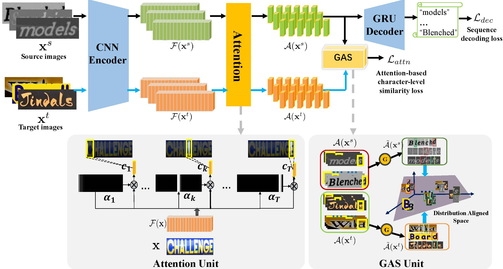
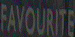
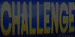
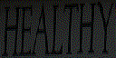
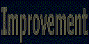

# Sequence-to-sequence Domain adaptation 
## Introduction 
We propose a novel Sequence-to-sequence Domain Adaptation Network dubbed SSDAN for robust text image recognition, which could be generalized to different scenes, such as natural scene text, handwritten text and mathematical expression recognition. The proposed SSDAN introduces a novel GAS unit in SSDAN to bridge the sequence-like text image recognition and domain adaptation, which could adaptively transfer fine-grained character-level knowledge instead of performing domain adaptation by global features. It is capable of using unsupervised sequence data to reduce domain shift effectively for robust text image recognition. 
  
## [Supplementary](https://drive.google.com/file/d/15hIJ8sFLmZ3A9sfcPYRArUfPkmbp0Nqk/view?usp=sharing) 

### Attention Visualization. 
            
             
## Implementations.  
### Dataset.  
For a toy sample, we can download the following datasets. 
#### Source synthetic text images.     
- A subset of [Synth 90k](http://www.robots.ox.ac.uk/~vgg/data/text/): 
``` wget http://www.cs.cmu.edu/~yuntiand/sample.tgz ``` 
``` tar zxf sample.tgz ```
#### Target text images.    
-  Real scene text images from ICDAR03, ICDAR13, IIIT5k and SVT:    
``` wget http://www.cs.cmu.edu/~yuntiand/evaluation_data.tgz ``` 
``` tar zxf evaluation_data.tgz ```

